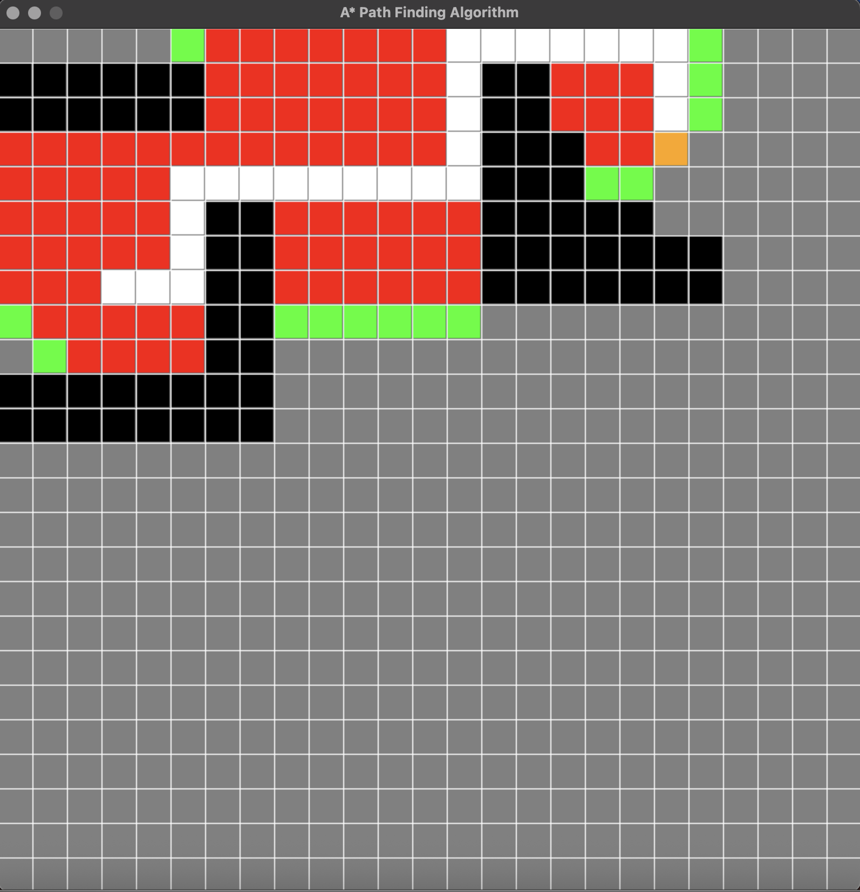

# A*
This is a GUI representation of A* search algorithm to demonstrate the working of A*. This representation might be necessary for students who want to understand A* path finding .
It is a great way to demonstrate how computer inputs and resolve a problem.    

White color:
    The White color represents the most optimal path found it is the final result state and the answer the algorithm.
Black color:
    Black color represents the boundaries the area not allowed to explore.
Red color:
    Red color represents the area that is already explored and not chosen as the path.
Green color:
    Green color represents the area that was to be explored until the final state was found. 
Grey color:
    Grey color is the unexplored area. 